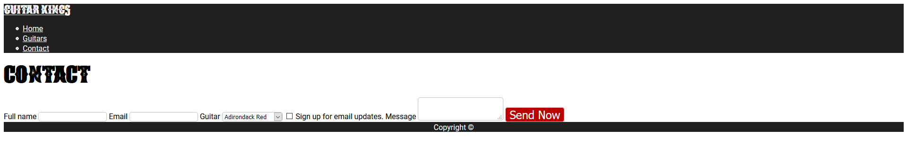

# HTML and CSS - Module 2

## Lesson Task 2 Question

In this lesson task we will be adding the contact form to the contact.html page.

## Brief

Add the various elements shown in the XD prototype to the contact.html page.

By the end of the task, you will have made a contact form that looks like this

